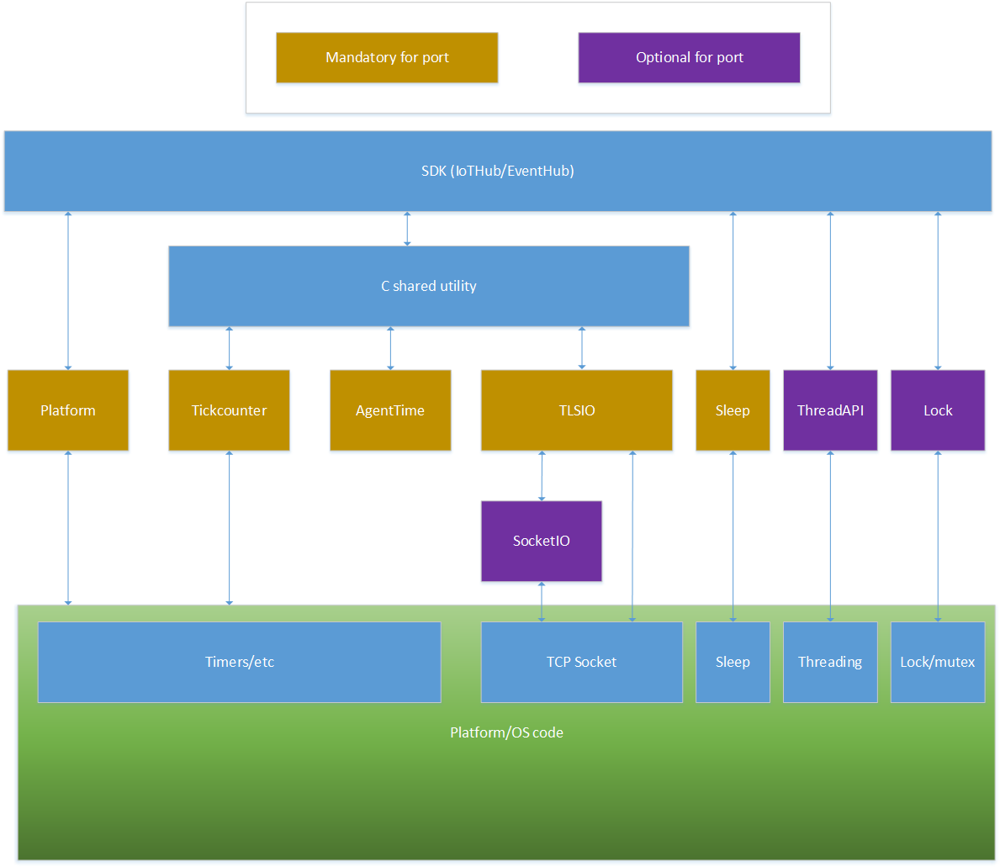
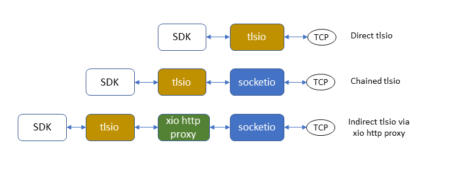

# How to Port the Azure IoT C SDK  to Other Platforms

The purpose of this document is to provide guidance on how to port the C Shared utility library to platforms not supported out of the box.
The C shared utility library is used by C SDKs like IoTHub client SDK and EventHub client SDK.  

The document does not cover the specifics of any particular platform.

## References

###### Specifications
- [tickcounter FreeRTOS reference](https://github.com/Azure/azure-c-shared-utility/blob/master/devdoc/tickcounter_freertos_requirement.md) 
- [agenttime adapter specification](https://github.com/Azure/azure-c-shared-utility/blob/master/devdoc/agenttime_requirements.md) 
- [threadapi and sleep adapter specification](https://github.com/Azure/azure-c-shared-utility/blob/master/devdoc/threadapi_and_sleep_requirements.md) 
- [platform adapter specification](https://github.com/Azure/azure-c-shared-utility/blob/master/devdoc/platform_requirements.md) 
- [tlsio specification](https://github.com/Azure/azure-c-shared-utility/blob/master/devdoc/tlsio_requirements.md) 
- [xio specification](https://github.com/Azure/azure-c-shared-utility/blob/master/devdoc/xio_requirements.md) 
- [lock adapter specification](https://github.com/Azure/azure-c-shared-utility/blob/master/devdoc/lock_requirements.md) 

###### Header files
- [tickcounter.h](https://github.com/Azure/azure-c-shared-utility/blob/master/inc/azure_c_shared_utility/tickcounter.h) 
- [threadapi.h](https://github.com/Azure/azure-c-shared-utility/blob/master/inc/azure_c_shared_utility/threadapi.h) 
- [xio.h](https://github.com/Azure/azure-c-shared-utility/blob/master/inc/azure_c_shared_utility/xio.h) 
- [tlsio.h](https://github.com/Azure/azure-c-shared-utility/blob/master/inc/azure_c_shared_utility/tlsio.h) 
- [socketio.h](https://github.com/Azure/azure-c-shared-utility/blob/master/inc/azure_c_shared_utility/socketio.h) 
- [lock.h](https://github.com/Azure/azure-c-shared-utility/blob/master/inc/azure_c_shared_utility/lock.h) 
- [platform.h](https://github.com/Azure/azure-c-shared-utility/blob/master/inc/azure_c_shared_utility/platform.h) 

# Table of contents

- [Overview](#Overview)
- [tickcounter adapter](#tickcounter-adapter)
- [agenttime adapter](#agenttime-adapter)
- [sleep adapter](#sleep-adapter)
- [platform adapter](#platform-adapter)
- [tlsio adapter overview](#tlsio-adapter-overview)
- [socketio adapter overview (optional)](#socketio-adapter)
- [tlsio adapter implementation](#tlsio-adapter-implementation)
- [threadapi and lock adapters (optional)](#threadapi-and-lock-adapters)

## Overview

The C shared utility library is written in C99 for the purpose of portability to most platforms.
However, several components rely on platform-specific resources in order to achieve the functionality required.
Thus, porting the C shared utility library is done by porting the PAL components (adapters) that are 
part of the library. Below is a rough overview of the components:

There are several mandatory components for which an adapter must be provided:

- A `tickcounter` implementation: this provides the SDK an adapter for getting a tick counter expressed in ms. 
The precision does not have to be milliseconds, but rather the value provided to the SDK has to be 
expressed in milliseconds.

- An `agenttime` implementation: this provides the SDK adapters for the C time management functions like 
`time`, `difftime`, etc. This is needed due to the very wide spread differences in the way time is 
handled by different platforms.

- A `sleep` implementation to provide a device-independent sleep function.

- A `platform` implementation to perform global init and de-init.

- A `tlsio` implementation to allow the SDK to communicate over TLS. The IoT Hub does not support insecure
communication.

Additionally, there are two optional components, `threadapi` and `lock`, that allow the SDK to communicate with 
an IoT Hub on a dedicated thread. Yet another optional component is the `socketio` adapter, which is used with
some kinds of `tlsio` adapter implementations.

There are several existing adapters that can be found under the  SDK's
[adapters directory](https://github.com/Azure/azure-c-shared-utility/blob/master/adapters)
and
[source directory](https://github.com/Azure/azure-c-shared-utility/blob/master/src).
If any of these adapters work for your device, simply include that file in your project directly.

### tickcounter adapter

Tickcounter behavior is exemplified by the
[tickcounter FreeRTOS reference](https://github.com/Azure/azure-c-shared-utility/blob/master/devdoc/tickcounter_freertos_requirement.md).

To get started, copy
[this version of tickcounter.c](https://github.com/Azure/azure-c-shared-utility/blob/master/pal/freertos/tickcounter.c) 
file and modify it to suit your device.

### agenttime adapter

The agenttime adapter is specified in
[agenttime adapter specification](https://github.com/Azure/azure-c-shared-utility/blob/master/devdoc/agenttime_requirements.md)
and provides platform-independent time functions.

For most platforms/OSs you can include the standard [agenttime.c](https://github.com/Azure/azure-c-shared-utility/blob/master/pal/agenttime.c)
file in your build. This adapter simply calls the C functions `time`, `difftime`, `ctime`, etc.

If this file does not work for your implementation, make a copy of it and modify it appropriately.

The Azure IoT SDK only requires the `get_time` and `get_difftime` functions. The other functions
in this adapter -- `get_gmtime`, `get_mktime`, and `get_ctime` -- are deprecated and 
may be omitted or left non-functional.

### sleep adapter

The sleep adapter is a single function that provides a device-independent thread sleep. Unlike other
adapters, it does not have its own header file. Instead, its declaration is contained in the 
[threadapi.h](https://github.com/Azure/azure-c-shared-utility/blob/master/inc/azure_c_shared_utility/threadapi.h)
file along with the declarations for the optional threadapi adapter, and its implementation is typically
contained in an associated threadapi.c file. 

Unlike the rest of the functions in
[threadapi.h](https://github.com/Azure/azure-c-shared-utility/blob/master/inc/azure_c_shared_utility/threadapi.h),
however, `ThreadAPI_Sleep` is required by the SDK and must always be functional.

The specification for the sleep adapter is found in the
[threadapi and sleep adapter specification](https://github.com/Azure/azure-c-shared-utility/blob/master/devdoc/threadapi_and_sleep_requirements.md).

### platform adapter

The platform adapter performs one time initialization and deinitialization for the platform and also supplies the SDK with an appropriate TLSIO.

The
[platform adapter specification](https://github.com/Azure/azure-c-shared-utility/blob/master/devdoc/platform_requirements.md)
gives full instructions for writing the platform adapter.

To get started creating your platform adapter, copy
[this Windows platform.c file](https://github.com/Azure/azure-c-shared-utility/blob/master/adapters/platform_win32.c)
and modify it to suit your needs.

### threadapi and lock adapters

The **threadapi** and **lock** adapters must exist for the SDK to compile, but their functionality is optional.
Their specification documents (see below) detail what each empty function should do if threading functionality
is not needed.

These components that allow the SDK to 
communicate with an IoT Hub within a dedicated thread. The use of a dedicated thread has some cost 
in memory consumption because of the
need for a separate stack, which may make the dedicated thread difficult to use on devices with little free
memory. 

The upside of the dedicated thread is that all current tlsio adapters may repeatedly
block for some fraction 
of a minute when attempting to connect to their IoT Hub when the network is unavailable, and having a thread
dedicated to the Azure IoT SDK will allow other device functions to remain responsive while the SDK is blocked.

Future versions of the SDK may eliminate this potential blocking behavior, but for now, devices which must
be responsive will need to use a dedicated thread for the SDK, which requires implementing the ThreadApi
and Lock adapters.

Here are the specs for the threadapi and lock adapters:
- [threadapi and sleep adapter specification](https://github.com/Azure/azure-c-shared-utility/blob/master/devdoc/threadapi_and_sleep_requirements.md) 
- [lock adapter specification](https://github.com/Azure/azure-c-shared-utility/blob/master/devdoc/lock_requirements.md) 

These specs explain how to create null _lock_ and _threadapi_ adapters for when threading is not desired.

To get started creating your threadapi and lock adapters, copy these Windows adapter files and modify
them appropriately:
- [threadapi.c](https://github.com/Azure/azure-c-shared-utility/blob/master/adapters/threadapi_win32.c)
- [lock.c](https://github.com/Azure/azure-c-shared-utility/blob/master/adapters/lock_win32.c)

### tlsio adapter overview

A **tlsio** adapter provides the SDK with secure TLS communication wtih the Azure IoT Hub. 

Tlsio adapters expose their functionality to the SDK via `xio`, which 
is a generic C-language bits-in-bits-out interface
[defined here](https://github.com/Azure/azure-c-shared-utility/blob/master/inc/azure_c_shared_utility/xio.h).

A tlsio adapter instance is created via the adapter's
[`xio_create`](https://github.com/Azure/azure-c-shared-utility/blob/bc5d4eb8f9dbe3092c9cf046db9b7187b5baad4b/inc/azure_c_shared_utility/xio.h#L64)
function, and the configuration parameter `const void* io_create_parameters`
must be of the specialized type
[`TLSIO_CONFIG`](https://github.com/Azure/azure-c-shared-utility/blob/master/inc/azure_c_shared_utility/tlsio.h)
when creating the tlsio instance.

Implementation of tlsio adapters for new devices is done by selecting the existing tlsio adapter (and perhaps also
a socketio adapter) that most closely fits your needs and modifying it accordingly.

##### The two styles of tlsio

There are two possible design patterns for a tlsio adapter: _direct_, and _chained_. In the _direct_ style, the
tlsio adapter owns a TCP socket which it uses to directly perform TLS communication with the remote host. In the
_chained_ style, the tlsio adapter does not own a TCP socket and does not communicate directly with the remote host.
Instead, it still does all the TLS chores like encryption, decryption, and negotiation, but it communicates with 
the remote host indirectly via yet another xio-style adapter of some sort.

The _direct_ style adapters require less code and avoid extra memory buffer copying, so they are more suited to
microcontrollers. The tlsio adapters for Arduino and ESP32 are both _direct_ types. The _chained_ style adapters 
are more resource-hungry, but they offer more flexibilty. The tlsio adapters for Windows, Linux, and Mac 
are all _chained_ style adapters. 

The choice of TLS implementation may dictate the style of tlsio. For example, the TLS implementations for Arduino and
Espressif's OpenSSL implementation for ESP32 can only work directly with their own internal TCP socket,
so they can only be used as part of a _direct_ style tlsio. By contrast, the full official version 
of OpenSSL can be used either way.

### socketio adapter overview

In order to connect to the internet, a _chained_ tlsio must at some point talk through an `xio` adapter 
that contains
a TCP socket. In the Azure IoT SDK, an `xio` adapter managing a TCP socket is called a `socketio` adapter.

Multiple xio components can be chained together if desired. Here is a diagram illustrating the differences
between a _direct_ tlsio, a _chained_
tlsio, and a _chained_ tlsio with an xio-based http proxy component:

The `xio_http_proxy` component is only shown to illustrate xio capability. Its details are beyond the 
scope of this document.

### tlsio adapter implementation

Adapters other than tlsio are easy to implement, even for inexperienced developers. The tlsio adapters, however,
are quite complicated, and writing a tlsio adapter is a task only for experienced developers who are comfortable 
setting up include directories and external libraries without instruction.

The most up-to-date information on tlsio implementation is contained in the 
[tlsio specification](https://github.com/Azure/azure-c-shared-utility/blob/master/devdoc/tlsio_requirements.md).

All of the existing tlsio adapters use TLS libraries that are not part of the Azure IoT SDK. Refer to the
documentation for the specific TSL libraries for instructions on library usage such as setting include
directories and linking library files.

#### Existing _direct_ tlsio implementations
There are two existing _direct_ adapter implementations:
- [tlsio_openssl_compact for ESP32](https://github.com/Azure/azure-iot-pal-esp32/blob/master/pal/src/tlsio_openssl_compact.c)
- [tlsio_arduino for Arduino](https://github.com/Azure/azure-iot-pal-arduino/blob/master/pal/src/tlsio_arduino.c)

Of these two, the
[tlsio_openssl_compact for ESP32](https://github.com/Azure/azure-iot-pal-esp32/blob/master/pal/src/tlsio_openssl_compact.c)
is probably the better candidate for copying for re-use because it is more likely to resemble newer devices, 
and it was written in tandem with the
[tlsio specification](https://github.com/Azure/azure-c-shared-utility/blob/master/devdoc/tlsio_requirements.md).

The 
[tlsio_openssl_compact for ESP32](https://github.com/Azure/azure-iot-pal-esp32/blob/master/pal/src/tlsio_openssl_compact.c)
abstracts its operating system dependencies using these two files:
- [socket_async.c](https://github.com/Azure/azure-c-shared-utility/blob/master/pal/socket_async.c)
- [dns_resolver_ares.c](https://github.com/Azure/azure-c-shared-utility/blob/master/src/dns_resolver_ares.c)

It is recommended that all _direct_ tlsio implementatons follow this pattern.

The
[socket_async.c](https://github.com/Azure/azure-c-shared-utility/blob/master/pal/socket_async.c)
and
[dns_resolver_ares.c](https://github.com/Azure/azure-c-shared-utility/blob/master/src/dns_resolver_ares.c)
files can be re-used without change for most socket implementations by merely changing the content of 
the included "socket_async_os.h" file, which contains os-specific headers.

#### Existing _chained_ tlsio implementations
_Chained_ adapter implementations include:
- [tlsio_openssl for Windows, Linux, and Mac](https://github.com/Azure/azure-c-shared-utility/blob/master/adapters/tlsio_openssl.c)
- [tlsio_schannel for Windows only](https://github.com/Azure/azure-c-shared-utility/blob/master/adapters/tlsio_schannel.c)
- [tlsio_wolfssl for embedded devices](https://github.com/Azure/azure-c-shared-utility/blob/master/adapters/tlsio_wolfssl.c)
- [tlsio_mbedtls for embedded devices](https://github.com/Azure/azure-c-shared-utility/blob/master/adapters/tlsio_mbedtls.c)

#### Existing socketio implementations for _chained_ tlsio adapters
There is no spec for socketio adapters, so it is necessary to copy the behavior of an existing one, and 
[socketio_berkeley](https://github.com/Azure/azure-c-shared-utility/blob/master/adapters/socketio_berkeley.c)
is the best candidate for copying. However, be aware that all existing socketio adapters including 
[socketio_berkeley](https://github.com/Azure/azure-c-shared-utility/blob/master/adapters/socketio_berkeley.c)
purge their pending io lists during socketio_destroy, which is incorrect. The pending io
lists should be purged during socketio_close instead.
- [socketio_berkeley for Linux, easily adapted to any Berkeley socket](https://github.com/Azure/azure-c-shared-utility/blob/master/adapters/socketio_berkeley.c)
- [socketio_win32 for Windows](https://github.com/Azure/azure-c-shared-utility/blob/master/adapters/socketio_win32.c)
- [tlsio_cyclonessl_socket for use with cyclonessl](https://github.com/Azure/azure-c-shared-utility/blob/master/src/tlsio_cyclonessl_socket.c)

### Adding device support repositories

Newly supported devices are likely to use a wide variety of possible build systems, so no single standard source 
tree can be prescribed. The [support repository for ESP32](https://github.com/Azure/azure-iot-pal-esp32) is the
one we recommend considering as a model for creating a new device support repository.

