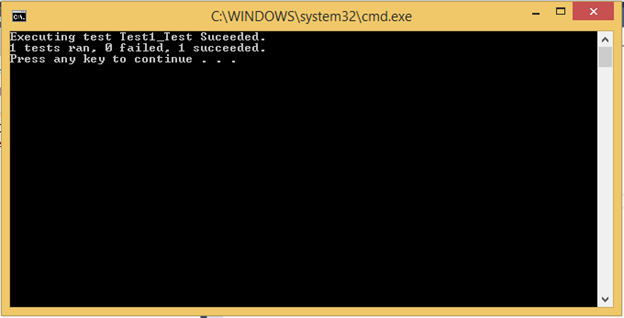

# CTest
 
## Overview

`CTest` is a `C` test harness. It provides a test runner and a set of assert macros that can be used to write tests.

`CTest` is designed to:

- Only use C for writing tests in order to minimize mixing C and C++ (sometimes the mix is just not desired)
- Maximize portability, thus trying to avoid at any costs compiler implementation specific features.
Using CTest
The following steps are required in order to use CTest:
- Include ctest.h in a .c file
- Write the tests in the .c file as part of a test suite
- Link the test runner in your executable
- As part of main (or any other function), execute the test suite

## The first test

The below example shows a simple test written by using CTest:

```c
#include "CTest.h"
#include "SomeUnitUnderTest.h"

CTEST_BEGIN_TEST_SUITE(SimpleTestSuiteOneTest)

CTEST_FUNCTION(Test1)
{
    // arrange

    // act
    int x = SomeFunction();

    // assert
    CTEST_ASSERT_ARE_EQUAL(int, 42, x);
}

CTEST_END_TEST_SUITE(SimpleTestSuiteOneTest)
```

In order to run the suite, the main function would contain:

```c
#include "CTest.h"

int main(int argc, char* argv[])
{
    CTEST_RUN_TEST_SUITE(SimpleTestSuiteOneTest);

    return 0;
}
```

The results would look like:


 
## Test suites

One test suite is supported per translation unit.

The beginning of a test suite is marked by the macro `CTEST_BEGIN_TEST_SUITE(suiteName)`.
The end of a test suite is marked by the macro `CTEST_END_TEST_SUITE(suiteName)`.

To run all the tests in a test suite the following macro can be used:

```c
CTEST_RUN_TEST_SUITE(suiteName{,failedTestCount});
```

The execution order of the tests in a test suite is not guaranteed. Tests are executed sequentially.

The `failedTestCount` argument for `CTEST_RUN_TEST_SUITE` is optional. If specified, the number of failed tests will be summed up in the `failedTestCount` variable, that is passed as argument.

## Fixtures

### CTEST_SUITE_INITIALIZE

This special fixture is executed before all the tests in the test suite. All resources allocated in `CTEST_SUITE_INITIALIZE` should be freed in `CTEST_SUITE_CLEANUP`.

```c
CTEST_SUITE_INITIALIZE()
{
    /* Some init code */
}
```

### CTEST_SUITE_CLEANUP

This special fixture is executed after all the tests in the test suite.

```c
CTEST_SUITE_CLEANUP()
{
    /* Free resources allocated in CTEST_SUITE_INITIALIZE */
}
```

### CTEST_FUNCTION_INITIALIZE

This special fixture is executed before calling each test function in the test suite. All resources allocated in `CTEST_FUNCTION_INITIALIZE` should be freed in `CTEST_FUNCTION_CLEANUP`.

```c
CTEST_FUNCTION_INITIALIZE()
{
    /* Initialize specific things for each test function */
}
```

### CTEST_FUNCTION_CLEANUP

This special fixture is executed after each test in the test suite.

```c
CTEST_FUNCTION_CLEANUP()
{
    /* Free resources allocated in CTEST_FUNCTION_INITIALIZE */
}
```

## Assert macros

Assert macros allow asserting various results and failing the tests if the asserted values/expressions fail.
By default if no assert macro fails a test, the test is reported as successful.

The following assert macros are supported by CTEST:

### CTEST_ASSERT_FAIL(message);

This macro fails the test and displays the message argument.

### CTEST_ASSERT_ARE_EQUAL(type, expected, actual, [format, …]);

This macro compares the expected and actual values, assuming they are of type “type” and fails the test if the values are different.

```c
CTEST_FUNCTION(Assert_Are_Equal_2_Ints_Fails)
{
    // arrange

    // act
    int x = SomeFunction();

    // assert
    CTEST_ASSERT_ARE_EQUAL(int, 42, x);
}
```

### CTEST_ASSERT_ARE_NOT_EQUAL(type, expected, actual, [format, …]);

This macro compares the expected and actual values, assuming they are of type `type` and fails the test if the values are equal.

```c
CTEST_FUNCTION(Assert_Are_Not_Equal_2_Ints_Fails)
{
    // arrange

    // act
    int x = SomeFunction();

    // assert
    CTEST_ASSERT_ARE_NOT_EQUAL(int, 0, x);
}
```

When using the `[format, …]` optional arguments to specify an assert message:

```c
CTEST_FUNCTION(Assert_Are_Not_Equal_2_Ints_Fails)
{
    // arrange

    // act
    int x = SomeFunction();

    // assert
    CTEST_ASSERT_ARE_NOT_EQUAL(int, 0, x, "{ Message with int: %d }", 42);
}
```

### CTEST_ASSERT_IS_NULL(value, [format, …]);

This macro fails the test if the value argument is not NULL.

```c
CTEST_FUNCTION(Assert_Is_NULL)
{
    // arrange

    // act
    void* x = SomeFunction();

    // assert
    CTEST_ASSERT_IS_NULL(x);
}
```

### CTEST_ASSERT_IS_NOT_NULL(value, [format, …]);

This macro fails the test if the value argument is NULL.

```c
CTEST_FUNCTION(Assert_Is_Not_NULL)
{
    // arrange

    // act
    void* x = SomeFunction();

    // assert
    CTEST_ASSERT_IS_NOT_NULL(x);
}
```

### CTEST_ASSERT_IS_TRUE(expression, [format, …]);

This macro fails the test if expression evaluates to zero.

```c
CTEST_FUNCTION(Assert_Is_True)
{
    // arrange

    // act
    int x = SomeFunction();

    // assert
    CTEST_ASSERT_IS_TRUE(x == 4);
}
```

### CTEST_ASSERT_IS_FALSE(value, [format, …]);

This macro fails the test if expression evaluates to something different than zero.

```c
CTEST_FUNCTION(Assert_Is_False)
{
    // arrange

    // act
    int x = SomeFunction();

    // assert
    CTEST_ASSERT_IS_FALSE(x != 4);
}
```

## Specialized comparer and string conversion function

### CTEST_COMPARE(niceType, type)

In order to allow comparing of specialized types (i.e. structures, etc.), the `CTEST_COMPARE` macro can be used:

```c
typedef struct mystruct_tag
{
    unsigned char x;
} mystruct;

CTEST_COMPARE(mystruct_ptr, mystruct*)
{
    return (left->x != right->x)
}
```

A comparer is responsible for comparing 2 values (passed as arguments): left and right.

`left` and `right`, are of the type “type”. The comparer function should return a value different than zero if the `left` and `right` values are different; otherwise, if the values are equal it should return zero.

The `niceType` is a `typedef` (cannot contain any invalid characters like space, *, etc).

### CTEST_TOSTRING(niceType, type, string, bufferSize, value)

```c
CTEST_TOSTRING(mystruct_ptr, mystruct*, string, bufferSize, value)
{
    (void)snprintf(string, bufferSize, "{ %d }", (int)value->x);
}
```

The function should print in `dst` the desired representation of value, where `value` is of type `type`, and `dst` is of type `char*`.

The `niceType` is a `typedef` (cannot contain any invalid characters like space, *, etc).

### Out of the box supported types

The `CTest` harness supports out of the box string formatting and comparers for the following types:

- `int`
- `char`
- `short`
- `long`
- `uint8_t`
- `int8_t`
- `uint16_t`
- `int16_t`
- `uint32_t`
- `int32_t`
- `uint64_t`
- `int64_t`
- `size_t`
- `float`
- `double`
- `long double`
- `char*` (`char_ptr`)

### CTEST_DEFINE_ENUM_TYPE

`CTEST_DEFINE_ENUM_TYPE` can be used with an enum defined by using the macro utils feature `MU_DEFINE_ENUM` in order to generate the needed `_ToString` and `_Compare` functions.

Example:

```c
#define TEST_ENUM_VALUES \
    TEST_VALUE_A, \
    TEST_VALUE_B

MU_DEFINE_ENUM(TEST_ENUM, TEST_ENUM_VALUES)
MU_DEFINE_ENUM_STRINGS(TEST_ENUM, TEST_ENUM_VALUES)
CTEST_DEFINE_ENUM_TYPE(TEST_ENUM, TEST_ENUM_VALUES)
```

### CTEST_DEFINE_ENUM_2_TYPE

`CTEST_DEFINE_ENUM_2_TYPE` can be used with an enum defined by using the macro utils feature `MU_DEFINE_ENUM_2` in order to generate the needed `_ToString` and `_Compare` functions.

Example:

```c
#define TEST_ENUM_VALUES \
    TEST_VALUE_A, 0 \
    TEST_VALUE_B, 1

MU_DEFINE_ENUM_2(TEST_ENUM, TEST_ENUM_VALUES)
MU_DEFINE_ENUM_STRINGS_2(TEST_ENUM, TEST_ENUM_VALUES)
CTEST_DEFINE_ENUM_2_TYPE(TEST_ENUM, TEST_ENUM_VALUES)
```
