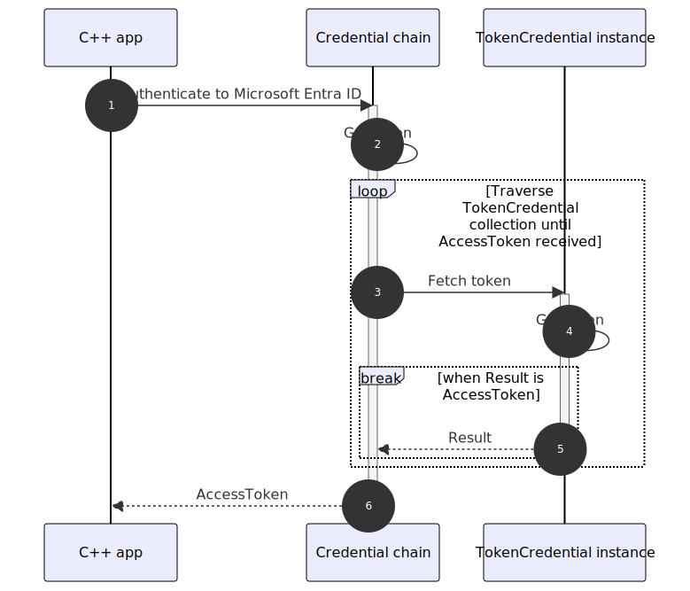

<!-- cspell: ignore devx mermaidjs
---
title: Credential chains in the Azure Identity client library for C++
description: This article describes the DefaultAzureCredential and ChainedTokenCredential classes in the Azure Identity client library for C++.
ms.date: 03/07/2025
ms.topic: conceptual
ms.custom: devx-track-cpp
---
-->
# Credential chains in the Azure Identity client library for C++

The Azure Identity client library provides *credentials*&mdash;public types that derive from the Azure Core library's [TokenCredential](https://azuresdkdocs.z19.web.core.windows.net/cpp/azure-core/latest/class_azure_1_1_core_1_1_credentials_1_1_token_credential.html) abstract base class. A credential represents a distinct authentication flow for acquiring an access token from Microsoft Entra ID. These credentials can be chained together to form an ordered sequence of authentication mechanisms to be attempted.

## How a chained credential works

At runtime, a credential chain attempts to authenticate using the sequence's first credential. If that credential fails to acquire an access token, the next credential in the sequence is attempted, and so on, until an access token is successfully obtained. The following sequence diagram illustrates this behavior:

<!--:::image type="content" source="../media/mermaidjs/chain-sequence.svg" alt-text="Diagram that shows credential chain sequence.":::-->


## Why use credential chains

A chained credential can offer the following benefits:

- **Environment awareness**: Automatically selects the most appropriate credential based on the environment in which the app is running. Without it, you'd have to write code like this:

    ```cpp
    // Set up credential based on environment (Azure or local development)
    std::shared_ptr<Azure::Core::Credentials::TokenCredential> credential;
    if (!std::getenv("WEBSITE_HOSTNAME"))
    {
        credential = std::make_shared<Azure::Identity::AzureCliCredential>();
    }
    else
    {
        credential = std::make_shared<Azure::Identity::ManagedIdentityCredential>();
    }
    ```

- **Seamless transitions**: Your app can move from local development to your staging or production environment without changing authentication code.
- **Improved resiliency**: Includes a fallback mechanism that moves to the next credential when the prior fails to acquire an access token.

## How to choose a chained credential

With C++, there are two choices for credential chaining:
- **Use a preconfigured chain**: Use the preconfigured chain implemented by the `DefaultAzureCredential` type. For this approach, see the [DefaultAzureCredential overview](#defaultazurecredential-overview) section.
- **Build a custom credential chain**: Start with an empty chain and include only what you need. For this approach, see the [ChainedTokenCredential overview](#chainedtokencredential-overview) section.

## DefaultAzureCredential overview

[DefaultAzureCredential](https://github.com/Azure/azure-sdk-for-cpp/tree/main/sdk/identity/azure-identity#defaultazurecredential) is an opinionated, preconfigured chain of credentials. It's designed to support many environments, along with the most common authentication flows and developer tools. In graphical form, the underlying chain looks like this:

<!--:::image type="content" source="../media/mermaidjs/DefaultAzureCredentialAuthFlow.svg" alt-text="Diagram that shows DefaultAzureCredential authentication flow.":::-->


The order in which `DefaultAzureCredential` attempts credentials follows.

| Order | Credential                      | Description                                                                                                                                                                                                                                                                                                                                    |
|-------|---------------------------------|------------------------------------------------------------------------------------------------------------------------------------------------------------------------------------------------------------------------------------------------------------------------------------------------------------------------------------------------|
| 1     | [Environment][env-cred]         | Reads a collection of [environment variables][env-vars] to determine if an application service principal (application user) is configured for the app. If so, `DefaultAzureCredential` uses these values to authenticate the app to Azure. This method is most often used in server environments but can also be used when developing locally. |
| 2     | [Workload Identity][wi-cred]    | If the app is deployed to an Azure host with Workload Identity enabled, authenticate that account.                                                                                                                                                                                                                                             |
| 3     | [Azure CLI][az-cred]            | If the developer authenticated to Azure using Azure CLI's `az login` command, authenticate the app to Azure using that same account.                                                                                                                                                                                                           |
| 4     | [Managed Identity][mi-cred]     | If the app is deployed to an Azure host with Managed Identity enabled, authenticate the app to Azure using that Managed Identity.                                                                                                                                                                                                              |

[env-cred]: https://github.com/Azure/azure-sdk-for-cpp/tree/main/sdk/identity/azure-identity#environment-variables
[wi-cred]: https://github.com/Azure/azure-sdk-for-cpp/tree/main/sdk/identity/azure-identity#authenticate-azure-hosted-applications
[az-cred]: https://github.com/Azure/azure-sdk-for-cpp/tree/main/sdk/identity/azure-identity#authenticate-via-development-tools
[mi-cred]: https://github.com/Azure/azure-sdk-for-cpp/tree/main/sdk/identity/azure-identity#managed-identity-support

In its simplest form, you can use the parameterless version of `DefaultAzureCredential` as follows:

```cpp
#include <azure/identity/default_azure_credential.hpp>
#include <azure/storage/blobs/blob_client.hpp>

int main()
{
    // create a credential
    auto credential = std::make_shared<Azure::Identity::DefaultAzureCredential>();

    // create a Blob service client
    auto blobUrl = "https://<my_account_name>.blob.core.windows.net/mycontainer/myblob";
    Azure::Storage::Blobs::BlobClient blobClient{blobUrl, credential};
}
```

## ChainedTokenCredential overview

[ChainedTokenCredential](https://github.com/Azure/azure-sdk-for-cpp/tree/main/sdk/identity/azure-identity#chained-token-credential) is an empty chain to which you add credentials to suit your app's needs. For example:

```cpp
#include <azure/identity/azure_cli_credential.hpp>
#include <azure/identity/chained_token_credential.hpp>
#include <azure/identity/managed_identity_credential.hpp>
#include <azure/storage/blobs/blob_client.hpp>

int main()
{
    // create a credential
    auto credential = std::make_shared<Azure::Identity::ChainedTokenCredential>(
        Azure::Identity::ChainedTokenCredential::Sources{
            std::make_shared<Azure::Identity::AzureCliCredential>(),
            std::make_shared<Azure::Identity::ManagedIdentityCredential>()});

    // create a Blob service client
    auto blobUrl = "https://<my_account_name>.blob.core.windows.net/mycontainer/myblob";
    Azure::Storage::Blobs::BlobClient blobClient{blobUrl, credential};
}
```


The preceding code sample creates a tailored credential chain comprised of two credentials. `AzureCliCredential` is attempted first, followed by `ManagedIdentityCredential`, if necessary. In graphical form, the chain looks like this:

<!--:::image type="content" source="../media/mermaidjs/chained-token-credential-auth-flow.svg" alt-text="Diagram that shows authentication flow for a ChainedTokenCredential instance that is composed of Azure CLI credential and managed identity credential.":::-->


> [!TIP]
> For improved performance, optimize credential ordering in `ChainedTokenCredential` for your production environment. Credentials intended for use in the local development environment should be added last.

## Usage guidance for DefaultAzureCredential

`DefaultAzureCredential` is undoubtedly the easiest way to get started with the Azure Identity client library, but with that convenience comes tradeoffs. Once you deploy your app to Azure, you should understand the app's authentication requirements. For that reason, strongly consider moving from `DefaultAzureCredential` to one of the following solutions:

- A specific credential implementation, such as `ManagedIdentityCredential`.
- A pared-down `ChainedTokenCredential` implementation optimized for the Azure environment in which your app runs.

Here's why:

- **Debugging challenges**: When authentication fails, it can be challenging to debug and identify the offending credential. You must enable logging to see the progression from one credential to the next and the success/failure status of each. For more information, see [Debug a chained credential](#debug-a-chained-credential).
- **Performance overhead**: The process of sequentially trying multiple credentials can introduce performance overhead. For example, when running on a local development machine, managed identity is unavailable. Consequently, `ManagedIdentityCredential` always fails in the local development environment.
- **Unpredictable behavior**: `DefaultAzureCredential` checks for the presence of certain [environment variables][env-vars]. It's possible that someone could add or modify these environment variables at the system level on the host machine. Those changes apply globally and therefore alter the behavior of `DefaultAzureCredential` at runtime in any app running on that machine.

## Debug a chained credential

To diagnose an unexpected issue or to understand what a chained credential is doing, [enable logging](https://github.com/Azure/azure-sdk-for-cpp/tree/main/sdk/identity/azure-identity#troubleshooting) in your app.
For illustration purposes, assume the parameterless form of `DefaultAzureCredential` is used to authenticate a request to a Blob Storage account. The app runs in the local development environment, and the developer authenticated to Azure using the Azure CLI. When the app is run, the following pertinent entries appear in the output:

```output
DEBUG : Identity: Creating DefaultAzureCredential which combines multiple parameterless credentials into a single one.
DefaultAzureCredential is only recommended for the early stages of development, and not for usage in production environment.
Once the developer focuses on the Credentials and Authentication aspects of their application, DefaultAzureCredential needs to be replaced with the credential that is the better fit for the application.
INFO  : Identity: EnvironmentCredential gets created with ClientSecretCredential.
DEBUG : Identity: EnvironmentCredential: 'AZURE_TENANT_ID', 'AZURE_CLIENT_ID', and 'AZURE_CLIENT_SECRET' environment variables are set, so ClientSecretCredential with corresponding tenantId, clientId, and clientSecret gets created.
WARN  : Identity: Azure Kubernetes environment is not set up for the WorkloadIdentityCredential credential to work.
INFO  : Identity: AzureCliCredential created.
Successful creation does not guarantee further successful token retrieval.
DEBUG : Identity: ManagedIdentityCredential: Environment is not set up for the credential to be created with App Service 2019 source.
DEBUG : Identity: ManagedIdentityCredential: Environment is not set up for the credential to be created with App Service 2017 source.
DEBUG : Identity: ManagedIdentityCredential: Environment is not set up for the credential to be created with Cloud Shell source.
DEBUG : Identity: ManagedIdentityCredential: Environment is not set up for the credential to be created with Azure Arc source.
INFO  : Identity: ManagedIdentityCredential will be created with Azure Instance Metadata Service source.
Successful creation does not guarantee further successful token retrieval.
INFO  : Identity: DefaultAzureCredential: Created with the following credentials: EnvironmentCredential, WorkloadIdentityCredential, AzureCliCredential, ManagedIdentityCredential.
DEBUG : Identity: DefaultAzureCredential: Failed to get token from EnvironmentCredential: GetToken(): error response: 400 Bad Request

{"error":"invalid_grant","error_description":"AADSTS53003: Access has been blocked by Conditional Access policies. The access policy does not allow token issuance. Trace ID: 11223344-5566-7788-9900-aabbccddeeff Correlation ID: ffeeddcc-bbaa-9988-7766-554433221100 Timestamp: 2025-03-07 21:25:44Z","error_codes":[53003],"timestamp":"2025-03-07 21:25:44Z","trace_id":"11223344-5566-7788-9900-aabbccddeeff","correlation_id":"ffeeddcc-bbaa-9988-7766-554433221100","error_uri":"https://login.microsoftonline.com/error?code=53003","suberror":"message_only","claims":"{\"access_token\":{\"capolids\":{\"essential\":true,\"values\":[\"01234567-89ab-cdef-fedc-ba9876543210\"]}}}"}
WARN  : Identity: WorkloadIdentityCredential authentication unavailable. See earlier WorkloadIdentityCredential log messages for details.
DEBUG : Identity: DefaultAzureCredential: Failed to get token from WorkloadIdentityCredential: WorkloadIdentityCredential authentication unavailable. Azure Kubernetes environment is not set up correctly.
INFO  : Identity: DefaultAzureCredential: Successfully got token from AzureCliCredential. This credential will be reused for subsequent calls.
DEBUG : Identity: DefaultAzureCredential: Saved this credential at index 2 for subsequent calls.
```

In the preceding output, notice that:

- `EnvironmentCredential`, and `WorkloadIdentityCredential` each failed to acquire a Microsoft Entra access token, in that order.
- The `AzureCliCredential` succeeds, as indicated by an entry that starts with "`Successfully got token from AzureCliCredential`". Since `AzureCliCredential` succeeded, no credentials beyond it were tried.


<!-- LINKS -->
[env-vars]: https://github.com/Azure/azure-sdk-for-cpp/tree/main/sdk/identity/azure-identity#environment-variables